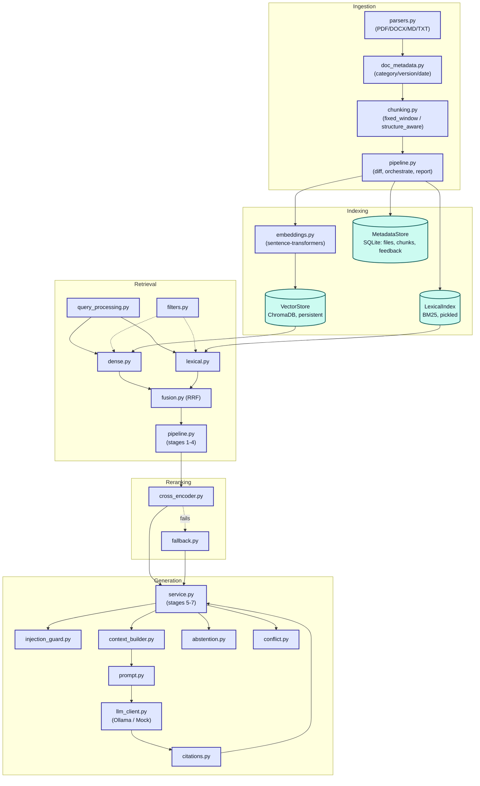
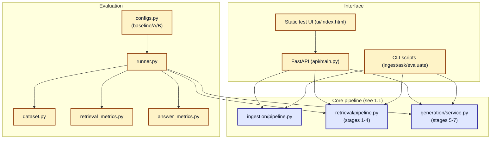
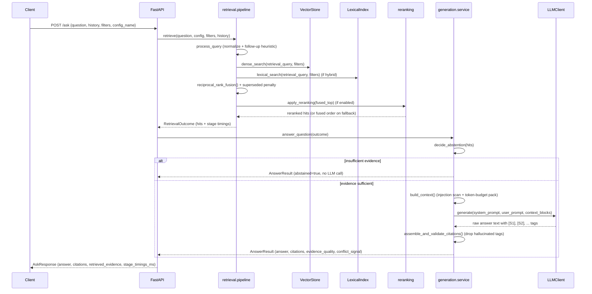

# Architecture

## 1. Component diagram

Split into two diagrams — the core request-processing pipeline, and its interfaces/evaluation
harness — rather than one large graph. Fewer crossing edges per diagram is deliberate: a single
diagram covering all seven subgraphs proved noticeably more prone to Mermaid's own layout-engine
edge-routing failures ("could not find a suitable point for the given distance") on GitHub than
either half is on its own.

### 1.1 Core pipeline: ingestion → indexing → retrieval → reranking → generation

Plain-text summary if the diagram doesn't render: **Ingestion** (parse → derive metadata → chunk →
diff against the metadata store) feeds **Indexing** (embed into Chroma, tokenize into BM25,
persist file/chunk records in SQLite). **Retrieval** queries both indexes, fuses them (RRF), and
applies metadata filters. **Reranking** re-scores the fused candidates with a cross-encoder,
falling back to the fused order if it's disabled or errors. **Generation** builds a token-budgeted,
injection-scanned context, prompts the LLM (Ollama or a deterministic mock), and validates the
model's citations against what was actually retrieved — gated by an **abstention** check that can
skip generation entirely.

### 1.2 Interfaces and evaluation harness

Both are thin callers of the same two entry points shown here (`ingestion/pipeline.py`,
`retrieval/pipeline.py`, `generation/service.py`) — see 1.1 for what's inside them.

The **API**, static **UI**, and **CLI scripts** are three thin front ends over the same
retrieval/generation pipeline. **Evaluation** runs that same pipeline under three named
configurations over a labeled question set and computes metrics.

## 2. Request sequence: `POST /ask`

## 3. Design decisions

| Decision | Rationale |
|---|---|
| Chroma + BM25, not a single hybrid engine | Keeps dense and lexical retrieval independently swappable/testable; fusion is an explicit, inspectable step (RRF) rather than hidden inside one library. |
| RRF for fusion | Dense cosine similarity and BM25 scores are on incompatible scales; RRF combines rank positions only, avoiding one scale silently dominating. |
| Two chunking strategies stored simultaneously | Lets the evaluation harness compare `fixed_window` vs `structure_aware` without a second ingestion pass; `chunk_strategy` is just another retrieval-config field. |
| Superseded documents stay retrievable, ranked lower | FR-12 asks the system to *flag* superseded content, not hide it — hiding it would make explicit historical/version questions unanswerable. |
| Abstention gates on `dense_score`, not the ranking score | RRF fused scores (~0.01-0.03) and cross-encoder logits (~±10) are not on a common, threshold-comparable scale; cosine similarity is the one signal present and stable across every configuration. Discovered as a real bug during evaluation — see `TECHNICAL_REPORT.md`. |
| Citation tags validated post-hoc | The model is asked to cite `[S<n>]` tags; any tag it invents that doesn't match a block actually supplied is stripped, so citations shown to the user always point at real, inspectable chunks. |
| Injection guard redacts whole sentences | Redacting only the matched trigger phrase left the attacker's payload (e.g., what to "respond only with") sitting right next to the redaction note; whole-sentence redaction removes it entirely. Word-boundary regexes use `\s+` rather than literal spaces so a mid-sentence line wrap in the source document can't dodge the pattern. |
| Metadata filters applied at query time, not post-fusion | The assignment's stage list orders filtering after fusion; we apply filters directly to the dense/lexical queries instead so a narrow filter can't be starved out by a top-k cut before fusion ever sees a match. Documented trade-off, not stage-order literalism. |
| `mock` LLM provider | Keeps ingestion, retrieval, and the entire automated test suite runnable with zero external dependencies, per the local-first requirement (4.4). |

## 4. Dependencies

See `requirements.txt`. Notable choices: `sentence-transformers` (embeddings + cross-encoder
reranker, both local), `chromadb` (persistent local vector store), `rank-bm25` (lexical index),
`pypdf` / `python-docx` (parsing), `fastapi` + `uvicorn` (API), `httpx` (Ollama client),
`fpdf2` (used only by `scripts/make_corpus.py` to generate the synthetic PDF sample).

## 5. Failure paths

| Failure | Behavior |
|---|---|
| A single document fails to parse (corrupted/encrypted/empty/unsupported) | Recorded in the `ProcessingReport` with a specific reason; ingestion continues for every other file; the index is never left partially written for that file (chunks + vector rows are only written after successful parsing and chunking). |
| Embedding model unavailable/errors | `/health` reports `embedding_model.ok: false`; `/ask` returns a 503 with a clear message rather than a stack trace (caught in `api/main.py`). |
| Reranker unavailable/errors/disabled | `reranking/fallback.py` catches the exception, falls back to the fused ranking, and reports `reranker_used: false` with a `reranker_fallback_reason` in every response — generation still proceeds. |
| LLM (Ollama) unreachable or returns an unexpected shape | `LLMUnavailableError` is caught in `generation/service.py`; the response explains generation is unavailable and still surfaces retrieved evidence for manual review, rather than crashing or fabricating an answer. |
| Insufficient/weak evidence | The abstention gate (`generation/abstention.py`) skips the LLM call entirely and returns a templated abstention message — this is a deterministic code path, not dependent on the model choosing to refuse. |
| Model hallucinates a citation | `generation/citations.py` strips any `[S<n>]` tag that doesn't correspond to a block actually sent to the model; stripped tags are counted (`invalid_citation_count`) for evaluation. |
| Prompt-injection text embedded in a document | `generation/injection_guard.py` redacts matched sentences before they reach the model; the system prompt additionally instructs the model to treat all evidence as untrusted data. Heuristic — see limitations in `TECHNICAL_REPORT.md`. |
| Oversized file | Skipped before it is even opened/hashed once it exceeds `DOCS_ASSISTANT_MAX_FILE_SIZE_MB` (default 25 MB), with a clear reason in the processing report. |
| Attempt to ingest an arbitrary filesystem path | The HTTP `/ingest` endpoint takes no path input at all — it only ever indexes the server's configured `documents_dir`. Ad-hoc paths are supported solely via the local, operator-run `scripts/ingest.py --path` CLI, never over the network API, to close off path traversal through the API. |
