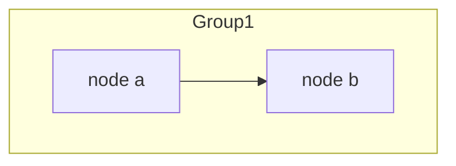
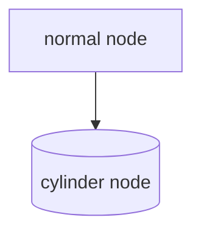
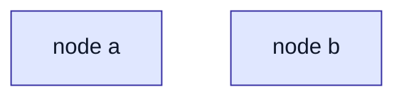
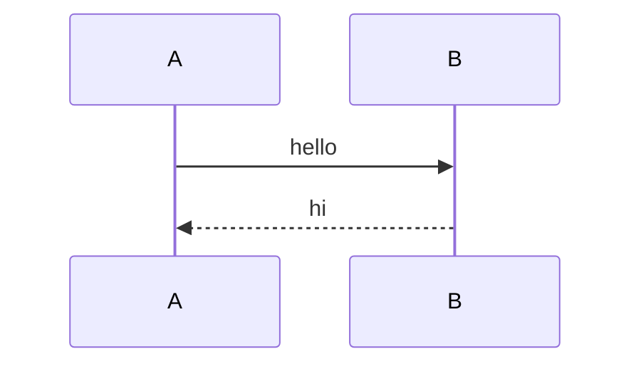

# Mermaid diagnostic (temporary — will be deleted)

## 0. Version info

```mermaid
info
```

## 1. Trivial flowchart


## 2. Subgraph only



## 3. Cylinder shape only



## 4. classDef/class only



## 5. Trivial sequence diagram


