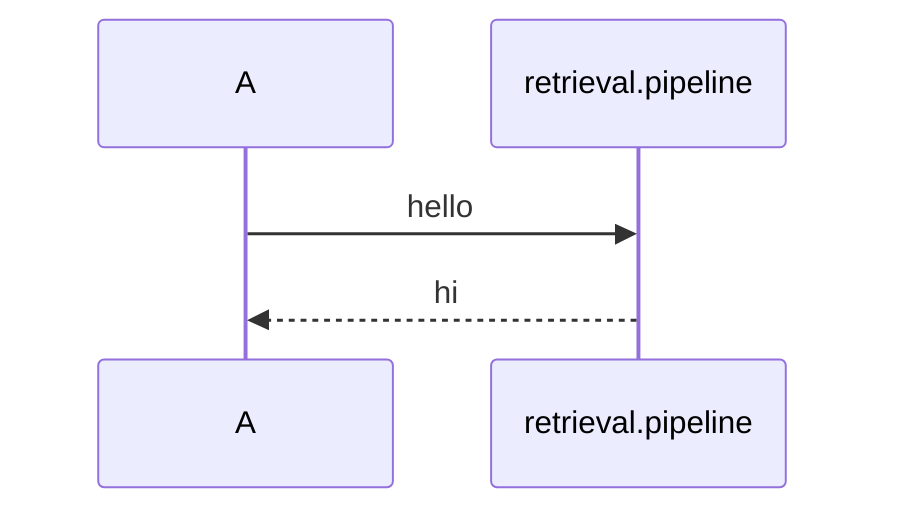
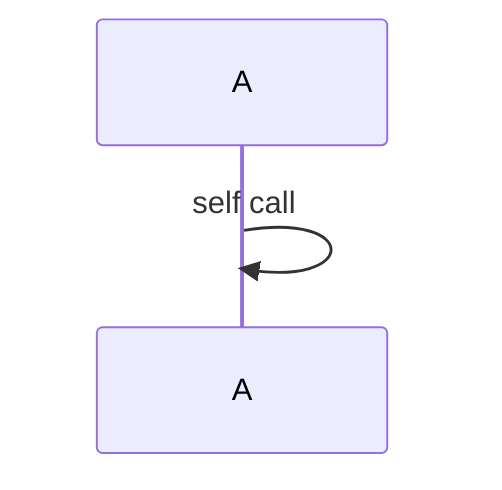
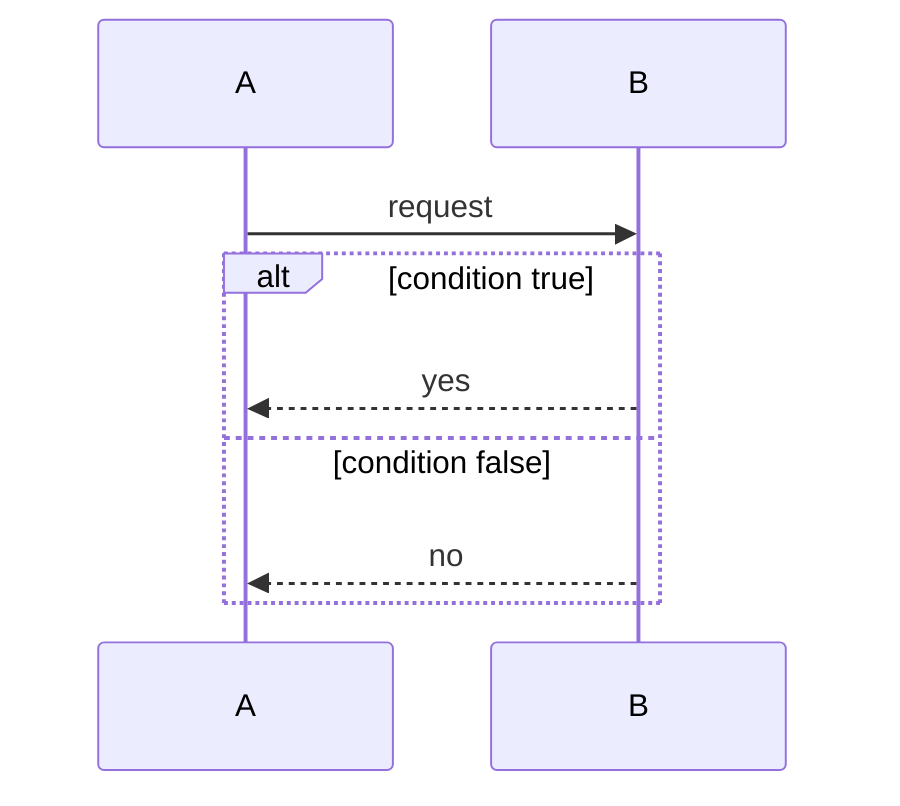
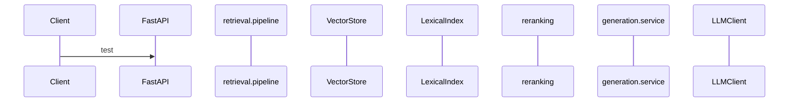
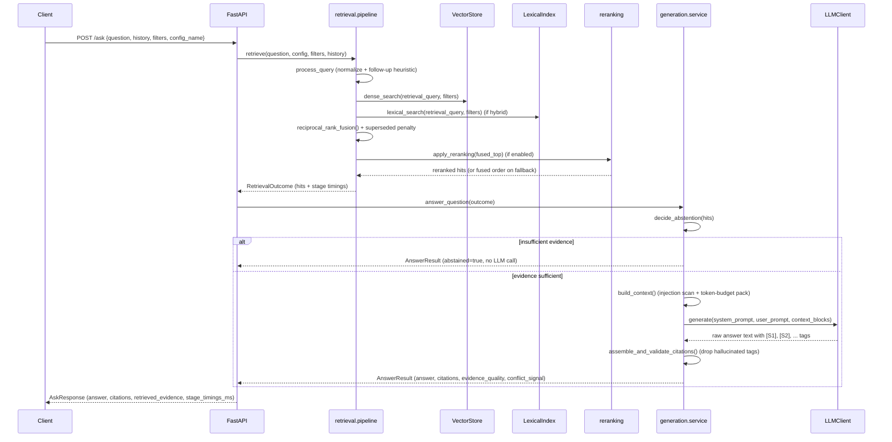

# Sequence diagram diagnostic (temporary — will be deleted)

## A. Dotted participant alias

## B. Self-message loop

## C. alt/else block

## D. Many participants (8, matching the real diagram)

## E. The real diagram, unmodified, for a fresh baseline read

